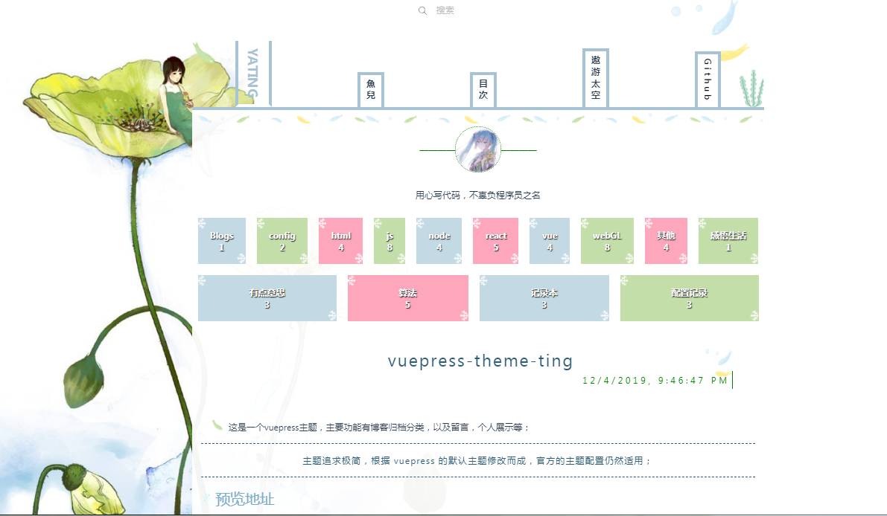
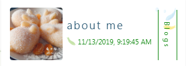
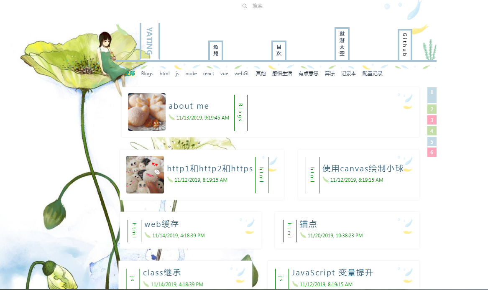
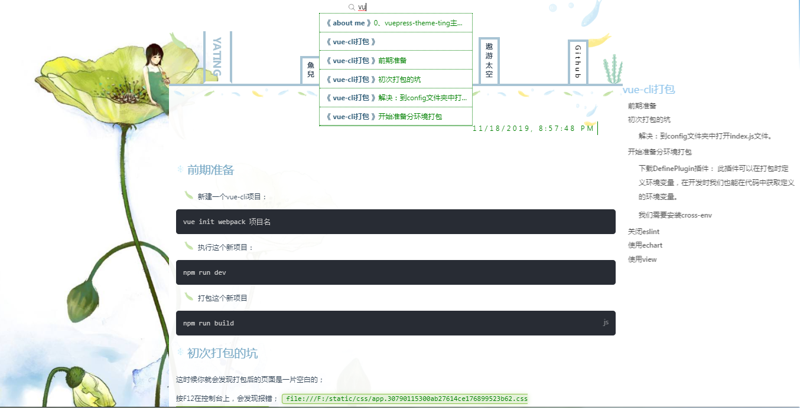
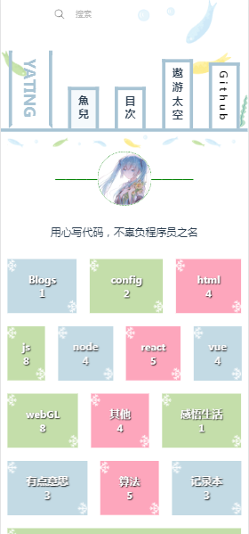
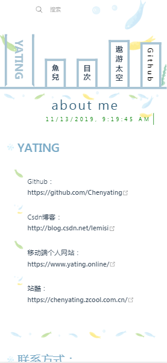
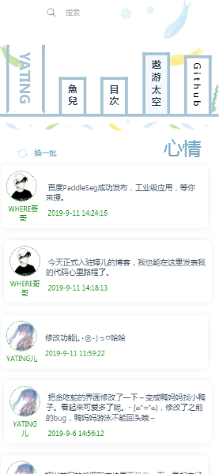

# vuepress-theme-ting

- 这是一个vuepress主题，主要功能有博客归档分类，以及留言，个人展示等；
  
> 主题追求极简，根据 vuepress 的默认主题修改而成，官方的主题配置仍然适用；

## 预览地址
[预览地址](https://chenyating.github.io/)


## install
```cmd
cd ting-Blog
npm install vuepress-theme-ting
```

## 基础配置
```js
// .vuepress/config.js
module.exports = {
 title: 'YATING',//网站名称
    description: '用心写代码，不辜负程序员之名',//网站描述
    //head标签
    head: [
        ['link', { rel: 'icon', type:"image/x-icon", href: '/img/logo.ico' }],//注意"/"就是public资源目录。标签的logo
    ],
    themeConfig: {
        author:'tinger',
        //导航栏
        nav: [
            { text: '主页', link: '/' },
            { text: '目录',link:'/config/catalog'},
            { text: '项目列表', link: '/config/about' },
            { text: 'Github',type:'url', link: 'https://github.com/Chenyating' },
        ],
        lastUpdated: 'Last Updated',//必填：文章显示最新修改时间
    },
    theme:'ting'//必填：使用vuepress-theme-ting 主题
}
```
## 所有配置
```js
// .vuepress/config.js
module.exports = {
 title: 'YATING',//网站名称
    description: '用心写代码，不辜负程序员之名',//网站描述
    //head标签
    head: [
        ['link', { rel: 'icon', href: '/img/logo.ico' }],//注意"/"就是public资源目录。标签的logo
    ],
    themeConfig: {
        author:'tinger',
        headImg:'https://yating.online/res/img/yating.jpg',//选填：头像
        //导航栏
        nav: [
            { text: '主页', link: '/' },
            { text: '目录',link:'/config/catalog'},
            { text: '项目列表', link: '/config/about' },
            { text: 'Github',type:'url', link: 'https://github.com/Chenyating' },
        ],
        lastUpdated: 'Last Updated',//必填：文章显示最新修改时间
        smoothScroll: true,//选填
        pageNum:5,//选填：目录每页显示条数
        gitalk:{//选填：gitalk留言设置
            clientID: '5b8613cfe15e02db85b7',
            clientSecret: 'd4129094c33b8da73e873470fb89aea53dfaf396',
            githubName:'Chenyating'
        },
        footer:'粤ICP备案号：18150247号'//选填
    },
    theme:'ting'//必填：使用vuepress-theme-ting 主题
}
```
- config/catalog.md
```yaml
---
layout: catalog
---
# 你的内容

```
- config/README.md
```yaml
---
layout: config
showMessage: false
title: 联系方式
---
# 你的内容
```

- README.md
```yaml
---
layout: index
showMessage: false
title: vuepress-theme-ting
---
# 你的内容
```

## 注意
在根目录下新建config文件
```
docs
│ 
├─.vuepress
│    ├─── public
│    └─config.js
│ 
├─config
│     ├─── catalog.md
│     └─── README.md
│ 
├─README.md
└─words：您的文档
```

### README.md抬头请写以下格式：

```yaml
---
layout: index
title: Home
showMessage: false;
---
```

layout：默认值为layout
```yaml
---
catalog：表示当前页为catalog页面；
index：表示为主页；
layout：默认文章内容（无需设置）
---
```

当前文章属性
```yaml
---
img:'tutu.jpg'
title：文章标题
showMessage：是否显示留言栏，侧边栏；默认为true
---
```

注意：文章的图片请保存在`.vuepress/public/img`路径下，对应图片将在目录中展示；
- 

## run
```
vuepress dev docs
```

## build
```
vuepress build docs
```

## 主页

## 目录

## 内容

## 其他


## 手机端预览效果
- 

## 感谢使用ting主题，给我一个start
[github主页](https://github.com/Chenyating)
[github项目](https://github.com/Chenyating/Chenyating.github.io)
### 当然我也不介意送我一杯咖啡(๑• . •๑)

- 


