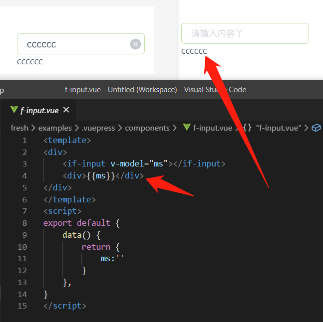

# input组件遇到的问题

## v-model问题

外部value变化，input的值没有变化？

- 

先理解v-model的性质
```html
<input v-model="searchText">
等价于
<input
  v-bind:value="searchText"
  v-on:input="searchText = $event.target.value"
>
```


组件上使用v-model
```html
<if-input v-model="searchText"></if-input>
等同于
<custom-input
  v-bind:value="searchText"
  v-on:input="searchText = $event"
></custom-input>
```

要让if-input能正常使用，必须：
1. 将其 value 特性绑定到一个名叫value的prop上
```js
   props: {
        value:{
            type:String,
            default:''
        }
    },
```

2. 在其 input 事件被触发时，将新的值通过自定义的input事件抛出
```html
自定义组件里的input要这么写：
<input :value="reciveValue" @input="inputMethod" />
```

注意：`reciveValue=this.value`，要指向value，不这么写，没法双向绑定。

```js
data(){
  return{
    reciveValue:this.value
  }
}

      inputMethod(e) {
            this.receiveValue=e.target.value;
            this.$emit('input', this.receiveValue);
        }
```

## 内部input变化，外部没有变化

- 

反正每次值发送变化的时候，就$emit一下

## input的方法
- 1、当input 获取到焦点时触发,最先触发
```js
  focusMethod(e) {
      this.$emit('focus', e)
  }
```
- 2、主要是用于 input type=button，当被点击时触发此事件
```js
  clickMethod(e) {
    this.$emit('click', e)
  }
```
- 3、input输入文字
```js
  keydownMethod(e) {
    this.$emit('keydown', e)
  }
```
- 4、当input的value值发生变化时就会触发，不用等到失去焦点
```js
  inputMethod(e) {
    if (this.readonly) {
        this.$emit('input', this.currentValue);
    } else {
        this.currentValue = e.target.value;
        this.$emit('input', this.currentValue);
    }
  }
```
- 5、完成输入，在此事件触发之前一定触发了onkeydown事件
```js
  keyupMethod(e) {
    this.$emit('keyup', e)
  }
```
- 6、离开input时，且表单的value发生变化触发，没有发生变化就不触发；
```js
  changeMethod(e) {
    this.$emit('change', e)
  }
```
- 7、当input失去焦点时触发，注意：这个事件触发的前提是已经获取了焦点再失去焦点的时候会触发相应的
```js
  blurMethod(e) {
    this.$emit('blur', e)
  }
```
- 8、表单选中内部内容触发
```js
  selectMethod(e) {
    this.$emit('select', e)
  }
```
